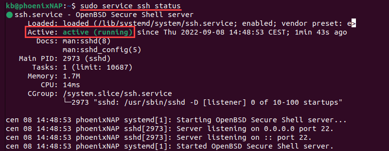
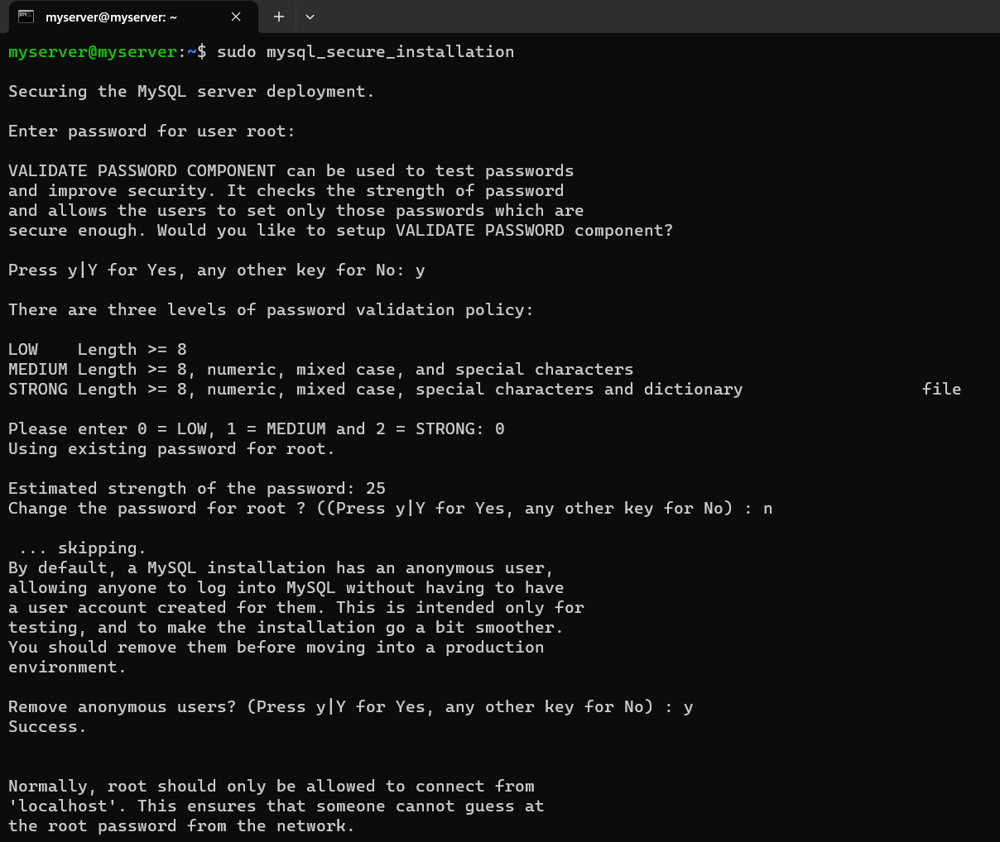
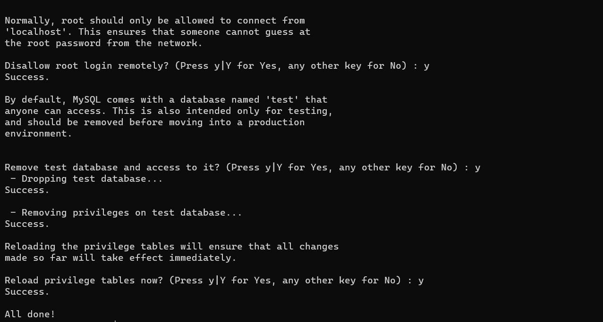
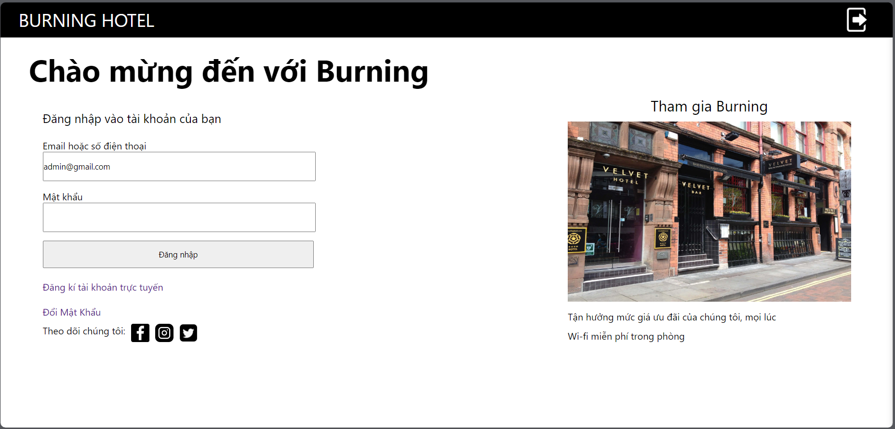

# HƯỚNG DẪN SETUP CHƯƠNG TRÌNH
## A. Cài đặt máy ảo
## B. Cài đặt môi trường
#### 1. **Sử dụng Git:**
     ```bash
     sudo apt update
     sudo apt install git
     ```
- Kiểm tra xem đã cài git thành công hay chưa:

    ```bash
    git --version
    ```
- Thiết lập tài khoản Git trên máy ảo:
    ```bash
    git config --global user.name "Tên của bạn"
    git config --global user.email "địa chỉ email của bạn"
    ```

#### 2. **Cài đặt và cấu hình SSH**
**2.1. Cài đặt**
- Cài đặt như sau:
     ```bash
    sudo apt-get update
    ```
    ```bash
    sudo apt-get install openssh-server -y
    ```
    ```bash
    sudo systemctl start sshd
    ```
    ```bash
    sudo systemctl enable ssh
    ```
- Để xác minh cài đặt thành công và SSH đang chạy, hãy sử dụng lệnh:
    ```bash
    sudo service ssh status
    ```
    
**2.2. Cấu hình SSH.**
- Mở file cấu hình:
    ```bash
    sudo nano /etc/ssh/sshd_config
    ```
- Cấu hình như sau:
    ```
    Include /etc/ssh/sshd_config.d/*.conf

    Port 22
    ListenAddress 0.0.0.0

    HostKey /etc/ssh/ssh_host_rsa_key
    HostKey /etc/ssh/ssh_host_ecdsa_key
    HostKey /etc/ssh/ssh_host_ed25519_key
    SyslogFacility AUTHPRIV
    PermitRootLogin yes
    PubkeyAuthentication yes
    AuthorizedKeysFile      .ssh/authorized_keys .ssh/authorized_keys2
    # Chophep/Tu choi SSH
    # AlowUsers user1
    # DenyUsers user1
    # Tu choi SFTP
    #Match User user2
    #ForceCommand /bin/false
    #Match User user3
    #ForceCommand internal-sftp

    UsePAM yes
    X11Forwarding yes
    PrintMotd no
    AcceptEnv LANG LC_*
    Subsystem sftp /usr/lib/openssh/sftp-server
    ```

- Để thực thi thay đổi, chạy lệnh:
    ```bash
    sudo systemctl restart sshd.service
    ```
**2.3. Cấu hình tường lửa.**
- Công cụ cấu hình tường lửa mặc định trong Ubuntu là UFW, cấu hình bằng lệnh:
    ```bash
    sudo ufw allow from any to any port 22 proto tcp
    ```

#### 3. Cài đặt mysql
- Cài đặt gói mysql:
    ```bash
    sudo apt install mysql-server -y
    ```
- Kích hoạt:
    ```bash
    sudo systemctl start mysql.service
    sudo systemctl is-active mysql
    ```
- Cài đặt passwork:
    ```bash
    sudo mysql
    ALTER USER root@localhost IDENTIFIED WITH mysql_native_password BY 'admin';
    ```
- Cài bảo mật cho mysql:
    ```bash
    sudo mysql_secure_installation
    ```
    
    

#### 4. Cấu hình máy chủ web Apache

- Sử dụng lệnh sau để cài đặt Apache trên máy ảo:
    ```bash
    sudo apt update
    sudo apt install apache2
    ```
- Kiểm tra trạng thái Apache:

    ```bash
    sudo systemctl status apache2
    ```

- Mở cổng truy cập cho Apache:
    ```bash
    sudo ufw allow 80/tcp
    ```

- Kiểm tra Apache bằng trình duyệt web:
    ```
    http://your_server_ip/
    ```
    `your_server_ip`: Địa chỉ IP của máy ảo.


#### 5. Cài đặt PHP
- Cài đặt PHP và các gói liên quan:
   ```bash
   sudo apt update
   sudo apt install php libapache2-mod-php php-mysql
   ```

        `php`: Cài đặt gói chính của PHP.
        `libapache2-mod-php`: Gói này liên kết PHP với Apache.
        `php-mysql`: Gói này cho phép PHP làm việc với cơ sở dữ liệu MySQL.

- Kiểm tra cài đặt PHP:
   ```bash
   php -v
   ```

- Kiểm tra tệp cấu hình:
   ```bash
   ls /etc/apache2/mods-enabled/php*.conf
   ```

- Khởi động lại Apache:
   ```bash
   sudo systemctl restart apache2
   ```

## C. Đưa project lên máy ảo
#### 1. Đưa file lên máy ảo và quản lý source bằng GIT
- Chuyển vào đường dẫn `/var/www` để clone project vào:
    ```bash
    cd ./var/www
    sudo git clone https://github.com/batruong1704/BurningHotel.git
    ```
#### 2. Export file .sql:
```sql
     mysql -u root -p
     CREATE DATABASE burninghotel
     USE burninghotel;
     source /path/to/yourfile.sql;
```
#### 3. Cấu hình Virtual Host
- Phân quyền cho tệp và thư mục:
    ```bash
    sudo chown -R www-data:www-data /var/www/html
    ```

- Khởi động lại Apache:
    ```bash
    sudo systemctl restart apache2
    ```

- Tạo một tệp cấu hình Virtual Host:
    ```bash
    sudo cp /etc/apache2/sites-available/000-default.conf /etc/apache2/sites-available/burninghotel.conf
    sudo nano /etc/apache2/sites-available/burninghotel.conf
    ```

- Cấu hình Virtual Host:
     ```apache
     <VirtualHost *:80>
        ServerAdmin webmaster@localhost
        ServerName burninghotel.com
        DocumentRoot /var/www/BurningHotel
         
         ErrorLog ${APACHE_LOG_DIR}/error.log
         CustomLog ${APAC
     HE_LOG_DIR}/access.log combined
     </VirtualHost>
     ```

- Kích hoạt Virtual Host và khởi động lại Apache:
    ```bash
    sudo a2ensite burninghotel.conf
    sudo systemctl restart apache2
    ```
#### 4. Ánh xạ tên miền:

- Mở tệp `/etc/hosts` để chỉnh sửa:
   ```bash
   sudo nano /etc/hosts
   ```

- Thêm các cặp tên miền và địa chỉ IP:
   ```plaintext
   ip_address burninghotel.com
   ```

#### 5. Cấu hình file hosts trên window
- File nằm trên địa chỉ `C:\Windows\System32\drivers\etc`, sau đó thêm ip_address và domain_name vào file và truy cập thử trên trình duyệt.
- Tại file hosts:
    ```
    # Copyright (c) 1993-2009 Microsoft Corp.
    #
    # This is a sample HOSTS file used by Microsoft TCP/IP for Windows.
    #
    # This file contains the mappings of IP addresses to host names. Each
    # entry should be kept on an individual line. The IP address should
    # be placed in the first column followed by the corresponding host name.
    # The IP address and the host name should be separated by at least one
    # space.
    #
    # Additionally, comments (such as these) may be inserted on individual
    # lines or following the machine name denoted by a '#' symbol.
    #
    # For example:
    #
    #      102.54.94.97     rhino.acme.com          # source server
    #       38.25.63.10     x.acme.com              # x client host
    192.168.179.134 burninghotel.com
    # localhost name resolution is handled within DNS itself.
    #	127.0.0.1       localhost
    #	::1             localhost
    ```
- Truy cập trên trình duyệt với địa chỉ:
    ```
    http://burninghotel.com/
    ```
    

===============================================================================================================================================================
# 1. GIT
### 1.1. Nhánh và các vấn đề liên quan tới nhánh:
- **Branch**:
     ```
     git branch `tuychon`
     ```
| Tùy Chọn               | Mô Tả                                                                           |
|-----------------------|---------------------------------------------------------------------------------|
| git branch           | Hiển thị danh sách các nhánh local và đánh dấu nhánh hiện tại bằng một dấu '*' |
| git branch -a        | Hiển thị tất cả các nhánh, bao gồm cả remote branches                            |
| git branch -d <tên>  | Xóa một nhánh local (nếu không có thay đổi chưa được kết hợp)                 |
| git branch -D <tên>  | Xóa một nhánh local mà không cần kiểm tra thay đổi                               |
| git branch -m <tên_cũ> <tên_mới>  | Đổi tên của một nhánh local                                                   |
| git branch -r        | Hiển thị danh sách các nhánh từ xa (remote branches)                             |
| git branch -v        | Hiển thị danh sách các nhánh local với thông tin về commit gần nhất            |
| git branch --set-upstream-to=<remote>/<tên> | Thiết lập theo dõi cho một nhánh local để theo dõi một nhánh từ xa |

- **Checkout:**
     ```
     git checkout `tuychon`
     ```
| Tùy Chọn           | Mô Tả                                                                                     |
|-------------------|-------------------------------------------------------------------------------------------|
| git checkout <tên_nhánh>         | Chuyển nhánh                                                                        |
| git checkout -b <tên_nhánh>      | Tạo một nhánh mới và chuyển sang nhánh mới đó                                              |
| git checkout -- <đường_dẫn_tệp>  | Loại bỏ thay đổi trên tệp đã chỉ định và khôi phục lại phiên bản trước đó của tệp   |
| git checkout -f                  | Đặt lại các thay đổi chưa commit trong thư mục làm việc hiện tại                         |
| git checkout <commit>            | Di chuyển HEAD và thư mục làm việc hiện tại đến commit đã chỉ định                    |

- **Các lệnh xử lý:**
     + Xem lịch sử commit của một nhánh:
        ```
        git log
        ```

     + So sánh nhánh với nhánh khác:
        ```
        git diff main..feature
        ```
 
     + Xem sự khác biệt giữa các thay đổi đã staged và commit:
          ```
          git diff --staged
          ```
     Ví dụ, để so sánh nhánh hiện tại (ví dụ: "main") với một nhánh khác (ví dụ: "feature"), bạn có thể sử dụng:

     + Xem thay đổi trên một commit cụ thể:
        ```
        git show <mã_commit>
        ```


